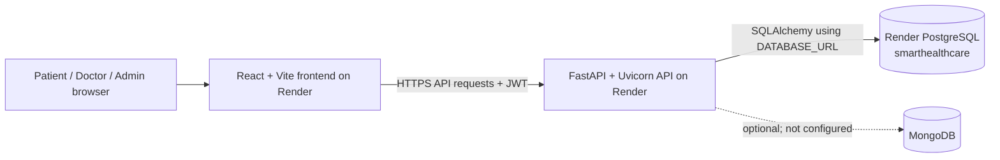

# SmartHealthcare Backend Overview

## Live architecture



The frontend is a Render static site. The Python API is a separate Render web service. The database is a third Render resource named `smarthealthcare-db`, in the Singapore region. Its database name is `smarthealthcare`. The Blueprint connects the API to it through the `DATABASE_URL` environment variable, so the real connection URL and password do not belong in source control or presentation slides.

## Backend technologies

- **Python 3.13.4** runs the API service.
- **FastAPI** defines request handlers, validation, OpenAPI documentation, and error responses.
- **Uvicorn** runs the FastAPI ASGI application.
- **Pydantic** validates request and response data.
- **SQLAlchemy 2** maps Python models to relational tables and manages queries.
- **PostgreSQL** is the live database. `psycopg` is its Python driver.
- **SQLite** is the default local development database. A legacy MySQL connection option remains available through PyMySQL.
- **bcrypt** hashes passwords before storage.
- **JWT (HS256)** provides signed, expiring bearer tokens; the configured token lifetime is 30 minutes.
- **PyMongo** can ping an optional MongoDB URI, but the current API workflows do not read or write MongoDB.
- **CORS middleware** allows the deployed frontend origin and local development origins.

The database module is still named `backend/app/database/mysql.py` for compatibility. It supports PostgreSQL, SQLite, and optional MySQL; the live Render database is PostgreSQL.

## Tables currently used

The API creates its SQLAlchemy model tables at startup with `Base.metadata.create_all()` and seeds the three role rows. There is no Alembic migration history in this project yet.

| PostgreSQL table | What it stores | Current use |
| --- | --- | --- |
| `roles` | `ADMIN`, `DOCTOR`, and `PATIENT` role names | Seeded by the API on startup |
| `users` | Names, email, role, active flag, phone, password hash, timestamps | Registration, login, profiles, demo accounts |
| `doctor_profiles` | A doctor's department and specialty | Doctor directory and appointment booking |
| `appointments` | Patient/doctor links, date/time, reason, status, diagnosis, treatment plan, clinical notes, timestamps | Live appointment workflow |
| `patients` | Optional patient demographics linked to a user | Model/table exists, but registration does not currently create patient rows |

Appointment status values are `SCHEDULED`, `CONFIRMED`, `COMPLETED`, `CANCELLED`, and `NO_SHOW`. There is no separate clinical-notes table: the three clinical fields are columns on `appointments`.

There are **no live tables** for prescriptions, medical records, analytics, data-exchange transactions, video consultations, or audit history. Those frontend pages contain sample preview data; they are not database-backed healthcare workflows. MongoDB collections described under `database/mongodb/` are design notes only.

## API map

| Method and path | Purpose |
| --- | --- |
| `GET /` | API service status |
| `GET /health` | Liveness check |
| `GET /ready` | Readiness check that requires PostgreSQL connectivity |
| `GET /database/health` | Shows relational DB connection and optional MongoDB status |
| `GET /docs` | Interactive Swagger API documentation |
| `POST /auth/register` | Public patient registration; other roles cannot self-register |
| `POST /auth/login` | Verify credentials and issue JWT |
| `GET /auth/me` | Read the signed-in user |
| `GET /auth/test/{admin,doctor,patient}` | Role-check demonstration endpoints |
| `GET /users/me` | Read own profile |
| `PATCH /users/me` | Update own name/contact fields |
| `POST /users/me/change-password` | Verify the current password and set a new password |
| `GET /appointments/doctors` | List active doctors who can receive bookings |
| `GET /appointments` | List appointments scoped to the signed-in role |
| `POST /appointments` | Patient books an appointment; checks for a matching doctor/time conflict |
| `PATCH /appointments/{id}/status` | Patient may cancel their own eligible booking; assigned doctor may confirm/complete/mark no-show/cancel |
| `PATCH /appointments/{id}/clinical-info` | Assigned doctor saves diagnosis, plan, and notes |
| `POST /admin/doctors` | Admin provisions a doctor account and profile |

## How to show the database to faculty

1. Open the [Render dashboard](https://dashboard.render.com/) and select the `smarthealthcare-db` PostgreSQL service. The `smarthealthcare-api` and `smarthealthcare-frontend` are separate services.
2. Open the database's **Connect** menu. For a local PostgreSQL client, use the **PSQL Command** / external connection option. Keep the connection URL private: it contains database credentials. Do not put it on slides or share it in screenshots.
3. In `psql`, list the tables with `\dt`, then show safe fictional demo rows with read-only queries such as:

   ```sql
   SELECT id, name, description FROM roles ORDER BY id;

   SELECT u.id, u.first_name, u.last_name, r.name AS role, u.is_active
   FROM users AS u
   JOIN roles AS r ON r.id = u.role_id
   ORDER BY u.id;

   SELECT id, patient_id, doctor_id, appointment_date, appointment_time,
          status, reason, diagnosis
   FROM appointments
   ORDER BY id;
   ```

   Never select or show the `users.password_hash` column. These queries only read data.

4. To show that the public API is connected, open `https://smarthealthcare-api-6ebh.onrender.com/database/health`. To demonstrate endpoint behavior, open `https://smarthealthcare-api-6ebh.onrender.com/docs` and show the appointment endpoints. Avoid submitting create/update requests during the presentation unless you intend to add another demo record.
5. For a visual database browser, Render documents pgAdmin as an optional database admin app; it can inspect schemas and run queries. It is not required by this project.

For a presentation, use only the fictional demo users and records. Do not enter real patient data. The production Render resources are configured for demonstration, not a certified clinical deployment.
